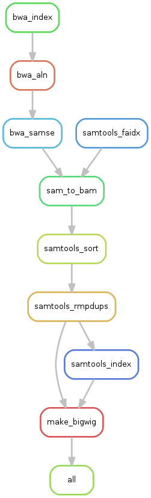

# Alignment workflow on our NGS data

## ChIP-SEQ workflow with ES input

### Files

* `ChIP-Seq/input/Snakefile` : main script for snakemake, call all RULES and config file.
* `ChIP-Seq/input/config.json` : config file which contain the list and location of all ChIP-SEQ and references files.
* `ChIP-Seq/input/RULES/full_mapping_using_ctrl_genome.rules` : All cmd from FastQC program (quality control)
* `ChIP-Seq/classic/RULES/bwa.rules` : All cmd from bwa (alignment to reference genome)
* `ChIP-Seq/classic/RULES/samtools.rules` : All cmd from samtools (sam/bam manipulation)
* `ChIP-Seq/classic/RULES/bigwig.rules` : R script call by snakemake to compute coverage in BigWig format.

### Minimal configuration

* Open config file (`config.json`) and type a directory where your data will be written (default `PROCESSED`).
* Indicate the directory were the raw files (`fastq` format) are stored (default `RAW`).
* Indicate the location, the name and the extension of the reference genome (default `""`,`female.hg19`,`.fa`).

### Run the workflow

Cmd : `snakemake -s Snakefile`.

### Rulegraph

## ChIP-SEQ workflow

### Files

* `ChIP-Seq/classic/Snakefile` : main script for snakemake, call all RULES and config file.
* `ChIP-Seq/classic/config.json` : config file which contain the list and location of all ChIP-SEQ and references files.
* `ChIP-Seq/classic/RULES/fastqc.rules` : All cmd from FastQC program (quality control)
* `ChIP-Seq/classic/RULES/bwa.rules` : All cmd from bwa (alignment to reference genome)
* `ChIP-Seq/classic/RULES/samtools.rules` : All cmd from samtools (sam/bam manipulation)
* `ChIP-Seq/classic/RULES/bigwig.rules` : R script call by snakemake to compute coverage in BigWig format.

### Minimal configuration

* Open config file (`config.json`) and type a directory where your data will be written (default `PROCESSED`).
* Indicate the directory were the raw files (`fastq` format) are stored (default `RAW`).
* Indicate the location, the name and the extension of the reference genome (default `""`,`female.hg19`,`.fa`).

### Run the workflow

Cmd : `snakemake -s Snakefile`.

### Rulegraph

